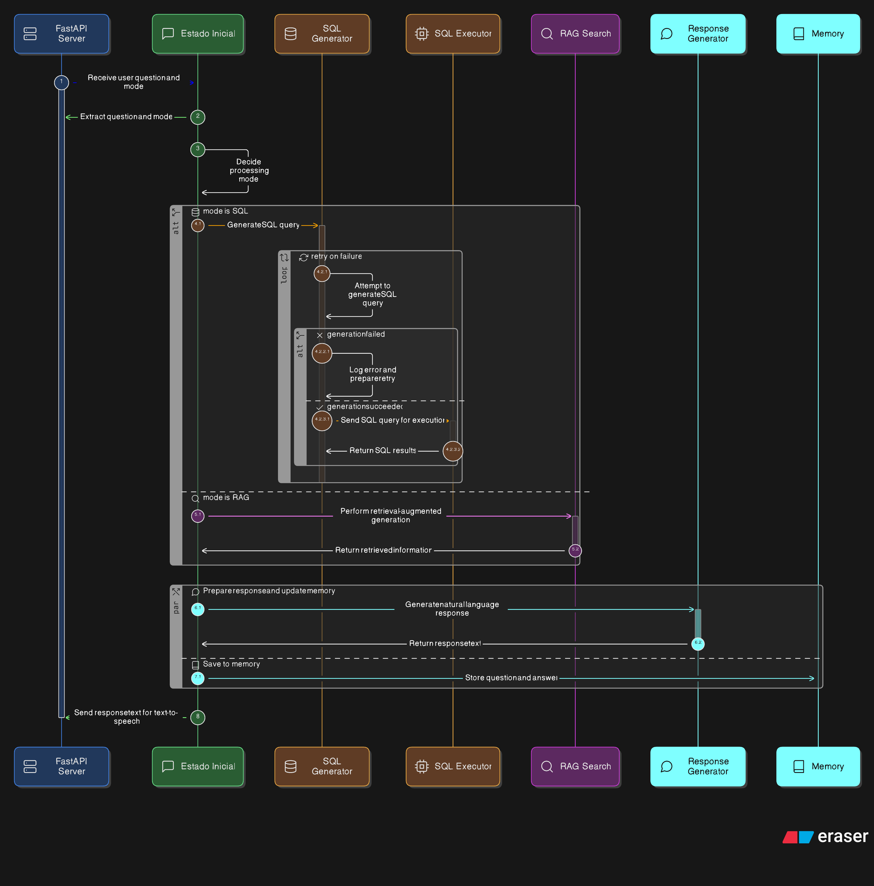

<div align="center">
  <!-- Aquí puedes colocar tu logo o imagen principal -->
  

  <h1>🤖 Trazea Agent</h1>
  <p><em>Asistente de IA para Trazea Management System</em></p>

  <p>
    <a href="https://www.python.org/downloads/"></a>
    <a href="https://fastapi.tiangolo.com/"></a>
    <a href="https://supabase.com/"></a>
    <a href="https://python.langchain.com/docs/langgraph/"></a>
    <a href="https://opensource.org/licenses/MIT"></a>
  </p>
</div>

---

**Trazea Agent** es un servicio de agente conversacional basado en IA que permite a los usuarios consultar información sobre inventario industrial de repuestos eléctricos mediante lenguaje natural, así como explorar manuales y documentos técnicos usando **RAG** (Retrieval-Augmented Generation). 

El agente funciona como backend de una aplicación de voz (Dynamo) que procesa preguntas y retorna respuestas optimizadas para audio.

## ✨ Características Principales

* 🗣️ **Procesamiento de lenguaje natural:** El agente entiende y procesa preguntas fluidas en español.
* 🔀 **Modo Dual (SQL y RAG):** 
  * 🗄️ **Consultas a Base de Datos (SQL):** Generación dinámica de SQL sobre inventario, garantías, movimientos técnicos, solicitudes entre bodegas, conteos y catálogo de repuestos.
  * 📚 **Búsqueda Semántica (RAG):** Búsqueda inteligente sobre documentos técnicos ingestados usando `pgvector` y embeddings locales (`all-MiniLM-L6-v2`).
* 🕸️ **Arquitectura basada en grafos:** Utiliza LangGraph para orquestar el flujo condicional de SQL (con reintentos automáticos en caso de fallos) y RAG.
* 🧠 **Memoria conversacional:** Mantiene el contexto histórico entre preguntas de una misma sesión.
* 🎙️ **Optimizado para voz:** Las respuestas se estructuran en un formato natural, descritas en palabras y sin listas complejas para una mejor síntesis de voz.

## 🏗️ Arquitectura del Sistema (LangGraph)

El sistema utiliza **LangGraph** para enrutar la petición según el modo (`sql` o `rag`) y manejar flujos de error de forma declarativa y completamente resiliente.



### 🧩 Componentes Básicos (`app/`)

* 🧭 **`graph.py`**: Definición general del estado del LangGraph, enrutamiento condicional.
* 📦 **`state.py`**: Esquemas obligatorios del estado (`AgentState`) que fluye a través de todo el grafo.
* 📝 **`sql_generator.py`**: Nodo que convierte preguntas a consultas SQL dinámicas basadas en el esquema de la base de datos PostgreSQL.
* ⚡ **`sql_executor.py`**: Ejecuta las consultas en la BD de forma asíncrona, con manejo predictible de errores y lógica de reintento.
* 🔎 **`rag_search.py`**: Nodo que busca fragmentos de texto en la base de datos vectorial (`pgvector`) usando un modelo local unificado (`all-MiniLM-L6-v2`). Implementa la técnica de *lazy loading* para ahorrar RAM.
* 💬 **`response_generator.py`**: Sintetiza inteligentemente la información obtenida para construir la respuesta final con un tono natural y fluido conversacional.
* 📄 **`ingest.py`**: Micro-herramientas de PDF (extracción y chunking con LangChain) para dar soporte al sistema RAG local.

## 📁 Estructura del Proyecto

```text
minca_agent/
├── main.py                    # 🚀 Servidor FastAPI y endpoints principales
├── requirements.txt           # 📦 Dependencias Python
├── Dockerfile                 # 🐳 Configuración del contenedor Docker
├── .env.example               # 🔑 Variables de entorno de ejemplo
├── Manual_Errores...          # 📑 Documento de ejemplo para RAG
│
├── app/                       # 🧠 Núcleo LangGraph
│   ├── graph.py               # Grafo y edges (router principal)
│   ├── state.py               # Definición AgentState
│   ├── sql_generator.py       # Nodo generador de consultas SQL
│   ├── sql_executor.py        # Nodo ejecutor de consultas
│   ├── rag_search.py          # Nodo de búsqueda semántica RAG
│   ├── response_generator.py  # Nodo generador de respuestas
│   └── ingest.py              # Utilidades de procesamiento de PDFs
│
├── scripts/                   # 🛠️ Scripts aislados / mantenimiento
├── utils/                     # 🔌 Conexiones (Supabase Async, Modelos LLMs)
└── tools/                     # 🔧 Herramientas secundarias
```

## 📋 Requisitos Previos

Asegúrate de tener instalado lo siguiente antes de empezar:

* 🐍 **Python 3.12+**
* 🐘 **PostgreSQL (vía Supabase)** con la extensión `pgvector` activada.
* 🔑 **API Keys funcionales** de Groq (principal) y/o Gemini (fallback).
* 💾 **Recursos de alojamiento:** Se recomiendan entre 128MB y 512MB de RAM para soportar la instanciación del modelo de embedding local.

## 🚀 Instalación

1. **Clonar el repositorio:**
   ```bash
   git clone <repositorio>
   cd minca_agent
   ```

2. **Crear entorno virtual:**
   ```bash
   python -m venv venv
   source venv/bin/activate  # Linux/Mac
   # o bien en Windows:
   venv\Scripts\activate     
   ```

3. **Instalar dependencias:**
   ```bash
   pip install -r requirements.txt
   ```

4. **Configurar variables de entorno:**
   ```bash
   cp .env.example .env
   # Edita el archivo .env con tus credenciales reales
   ```

## ⚙️ Variables de Entorno

| Variable | Descripción |
|----------|-------------|
| `SUPABASE_DB_URL` | URL de conexión a PostgreSQL de Supabase. **Requiere** `pgvector`. |
| `GROQ_API_KEY` | API key de Groq (Recomendado/Principal por su alta velocidad de inferencia). |
| `GEMINI_API_KEY` | API key de Gemini (Fallback exclusivo LLM, los embeddings son locales). |
| `AGENT_SERVICE_SECRET` | Token secreto compartido con las Edge Functions para proteger los endpoints. |
| `PORT` | Puerto HTTP de escucha local (por defecto: `8000`). |

## 💻 Uso Local

### ▶️ Iniciar el servidor

Arranca el servidor de desarrollo apoyado por `uvicorn`:

```bash
uvicorn main:app --reload
```

### 📡 Endpoints Expuestos

**1. Verificación de Salud (Health Check):**
```bash
GET http://localhost:8000/health
```

**2. Procesamiento de Conversación:**
```bash
POST http://localhost:8000/procesar-pregunta
Authorization: Bearer <TU_AGENT_SERVICE_SECRET>
Content-Type: application/json

{
  "pregunta": "¿Cuál es la política de garantía de la batería Minimoto?",
  "session_id": null,  // ID numérico/alfanumérico de la sesión
  "modo": "rag"        // Modos válidos: "sql" o "rag"
}
```

## 🎯 Modalidades de Consulta

* 📊 **Modo SQL (`"modo": "sql"`):** Orientado a métricas exactas en tiempo real (cantidades, inventarios temporales o históricos de movimientos técnicos), formulando análisis a partir del esquema *hardcodeado* de PostgreSQL en los prompts.
* 🔍 **Modo RAG (`"modo": "rag"`):** Diseñado para extraer respuestas teóricas y documentación estática de manuales previamente indexados en la base de datos. Se respalda en la métrica de `cosine distance`.

## ☁️ Despliegue

### 🐳 Ambiente Docker

Despliega una imagen consistente desde cualquier lugar:

```bash
docker build -t minca-agent .
docker run -p 8000:8000 --env-file .env minca-agent
```

### 🚂 Cloud (Railway / Render)

El proyecto está optimizado y preparado para plataformas PaaS con plan gratuito gracias a la instanciación diferida *(lazy loading)* del modelo HNSW-Embedding.
* **Puerto Exigido:** `8000`
* **Health Check Path:** `/health`

